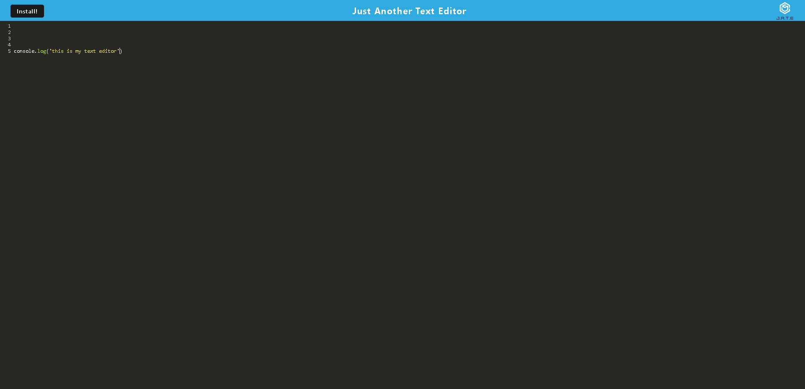

# text-editor

## Table of Contents
1. [Description](#description)
2. [Visuals](#visuals)
3. [Resources](#resources)

## Description

This project utilizes webpack and plugins to create a dist folder for the client with bundled files. This project also utilizes a service worker to save clients from having to request items from the server often. This project also utilizes the indexDB database.

I have been unable to get my install button to work properly, even after meeting with a tutor and basing it completely off of code from previous activities. I will be coming back to fix it after further guidance.

## Visuals

Heroku deployed site:

## Resources

[Git Hub Repository](https://github.com/vmalie3/text-editor)

[Heroku](https://radiant-hollows-41625.herokuapp.com/)

